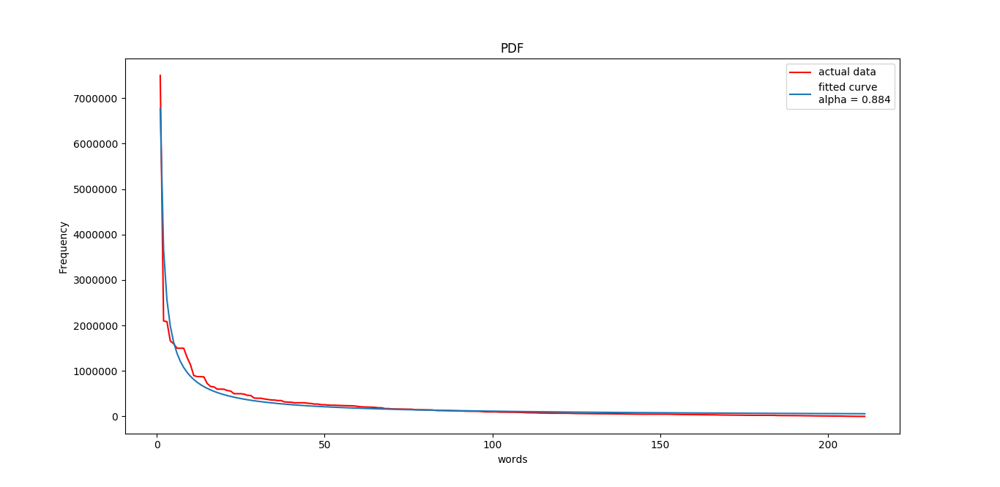
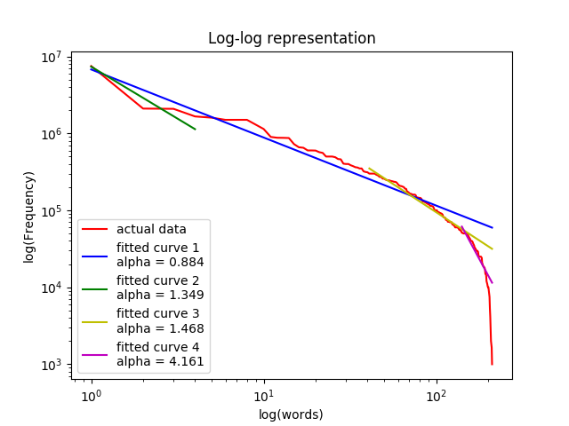

# Social network analysis
### Assignment 2 : Studying Zifp's law

Following are required to run the code....
+ Python 3.6.8
+ Matplotlib
+ Scipy
# #

*Here is the [project report](project%20report.pdf) for more insights*
